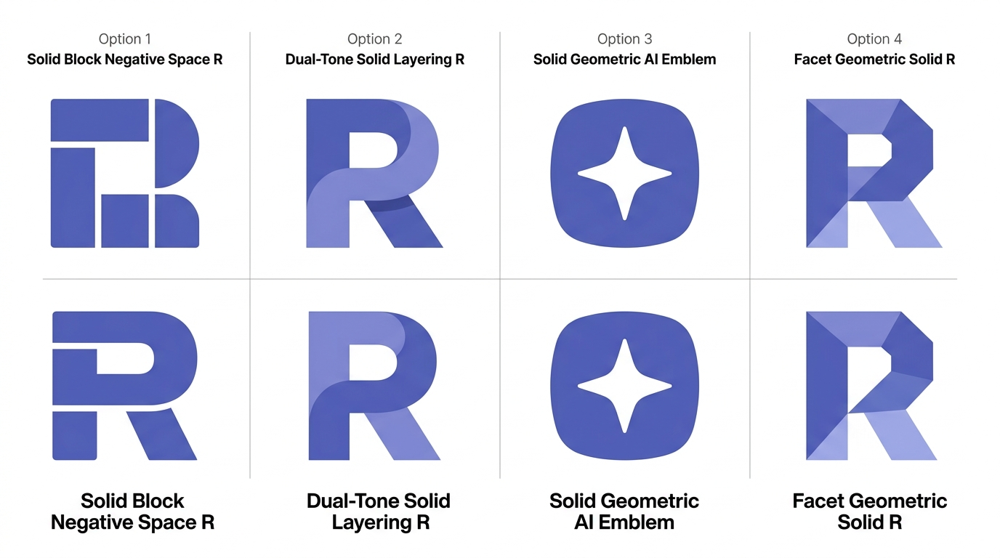
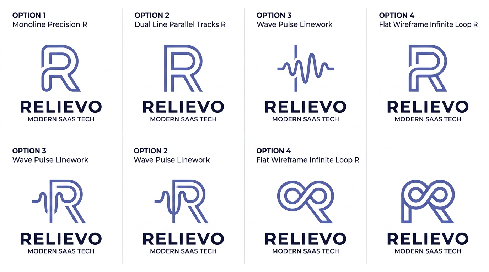
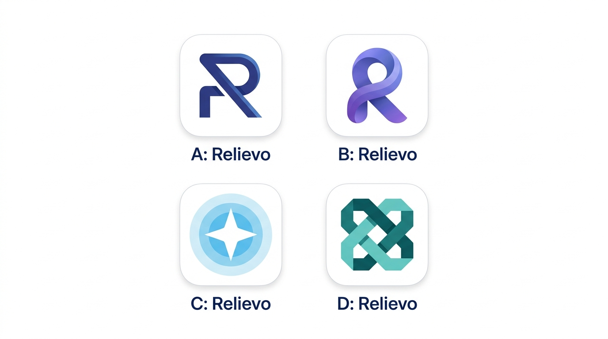

# 🎨 Relievo 睿舒智慧 · 品牌 Logo 設計與視覺指南 (LOGO_GUIDE.md)

> **品牌名稱**：Relievo 睿舒智慧  
> **定位**：服務業多約束排程與智慧派工雲端平台 (Multi-Industry Scheduling & Dispatch SaaS)  
> **核心調色盤**：Muted Iris 柔和鳶尾紫藍 (`#5560BD` / `#6B76CE` / `#919CE0`) ＋ Slate 護眼石板灰 (`#1E293B` / `#F8FAFC`)

---

## ⬛ 系列一：扁平實心填滿款 (Flat Solid-Filled · 最新推薦)

純 2D 幾何色塊填滿，具備最強的視覺份量感，在 `16x16px` Favicon、手機 App 圖示或實體招牌上皆具備 100% 銳利度與辨識度。



### 4 款設計說明：
1. **Option 1（幾何色塊負空間 R）**：
   - 大膽的實心矩形與圓角塊，透過負空間切出「R」，純粹俐落、極簡硬核（類似 Linear / Figma / Vercel 風格）。
2. **Option 2（雙色疊層實心 R · 推薦首選 🌟）**：
   - 深鳶尾紫（`#5560BD`）與淺鳶尾紫（`#919CE0`）兩片實心色塊交疊拼合。
   - 象徵「空間床位」與「技師資源」的無衝突完美嵌合（Zero-Conflict Fit）。
3. **Option 3（實心星芒徽章）**：
   - 圓角超橢圓徽章中挖出四芒星，具備 AI 演算核心晶片印記感。
4. **Option 4（幾何切面實心 R）**：
   - 多個純色多邊形拼接成幾何折面 R，呈現經典瑞士平面設計（Swiss Design）張力。

---

## 📐 系列二：扁平極簡線條款 (Flat Linework Vectors)

純 2D 等寬或平行幾何線條，強調精準架構感、開闊度與呼吸感。



### 4 款設計說明：
1. **Option 1（單線極簡等寬 R）**：一筆到底的等寬圓角連續路徑，極簡開闊。
2. **Option 2（雙軌平行線 R · 推薦首選 🌟）**：雙道精準等距平行線，完美對應系統核心演算法的「雙軌並行——技師雙輪牌 ＋ 空間排程」。
3. **Option 3（心率經絡波紋 R）**：左側經絡調理脈衝波過渡至 R 字，美業舒活放鬆意象鮮明。
4. **Option 4（平面無限雙環 R）**：莫比烏斯環 `∞` 扁平化結合字母 R，代表排程永續運作與派工閉環。

---

## 📱 系列三：立體漸層與 App Icon 款

柔和漸層與光影層次，適合應用商店圖示與大型品牌宣傳看板。



---

## 📊 各系列評估與推薦矩陣

| 系列 | 推薦款式 | 核心符號 | 視覺特性 | 16px Favicon 表現 | 推薦應用場景 |
| :--- | :--- | :--- | :--- | :--- | :--- |
| **扁平實心** | **雙色疊層實心 R** | 色塊交疊 R | 份量感強、飽滿俐落 | ⭐️⭐️⭐️⭐️⭐️ (極高) | 品牌主識別、系統 Favicon、App 圖示、實體招牌 |
| **扁平線條** | **雙軌平行線 R** | 平行雙線 R | 幾何精密、架構清晰 | ⭐️⭐️⭐️⭐️⭐️ (極高) | 現代 Web SaaS Header、技術文件、名片識別 |
| **立體漸層** | **幾何幾鋒 R** | 切角折線 R | 現代科技、光影層次 | ⭐️⭐️⭐️⭐️☆ | 行銷官網 Banner、大螢幕宣傳展示 |

---

## 💻 推薦款 SVG 向量程式碼 (即插即用)

### 款式 A：雙色疊層實心 R (Flat Solid Layering)
```svg
<svg viewBox="0 0 48 48" fill="none" xmlns="http://www.w3.org/2000/svg" class="w-10 h-10">
  <!-- Back/Upper Loop: Light Muted Iris (#919CE0) -->
  <path
    d="M12 18C12 11.3726 17.3726 6 24 6C30.6274 6 36 11.3726 36 18C36 24.6274 30.6274 30 24 30H12V18Z"
    fill="#919CE0"
  />
  <!-- Front Dynamic Leg & Pillar: Solid Deep Iris (#5560BD) -->
  <path
    d="M12 6H20V42H12V6ZM24 24L36 42H25.5L16.5 28.5L24 24Z"
    fill="#5560BD"
  />
  <!-- Inner Negative Space Cutout -->
  <circle cx="24" cy="18" r="6" fill="#F5F6FC" />
</svg>
```

### 款式 B：雙軌平行線 R (Dual-Track Monoline)
```svg
<svg viewBox="0 0 48 48" fill="none" xmlns="http://www.w3.org/2000/svg" class="w-10 h-10">
  <path
    d="M12 40V8H26C31.5228 8 36 12.4772 36 18C36 22.8488 32.5512 26.8923 28 27.79V28L36.5 40"
    stroke="#5560BD"
    stroke-width="3.5"
    stroke-linecap="round"
    stroke-linejoin="round"
  />
  <path
    d="M18 36V14H25.5C27.9853 14 30 16.0147 30 18.5C30 20.9853 27.9853 23 25.5 23H18"
    stroke="#5560BD"
    stroke-width="3.5"
    stroke-linecap="round"
    stroke-linejoin="round"
  />
</svg>
```
